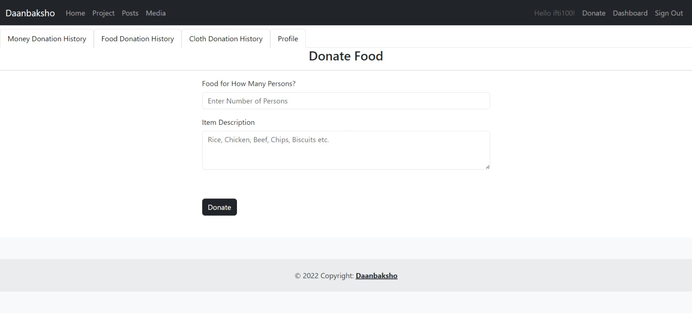
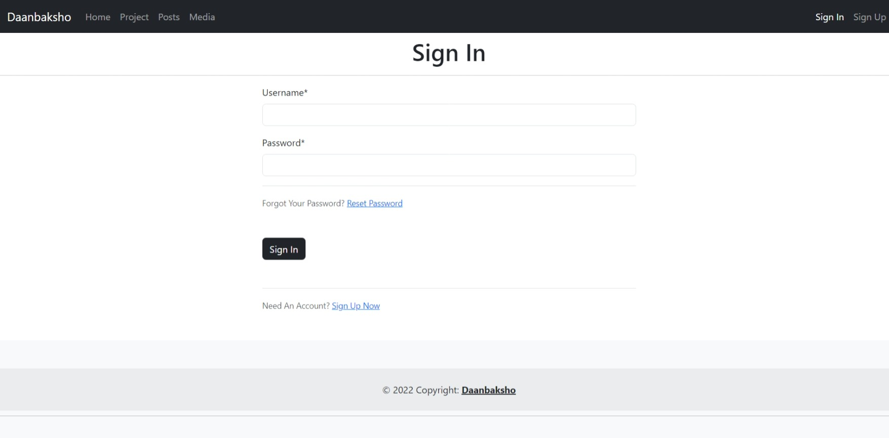

# Daanbaksho

### Note: This project was built in the beginning of my Django journey. Hence, so basic design.

Daanbaksho is a donation management system. It has functionalities to donate money, food, and clothes. It integrates Tawk.to chat API. The system is designed to handle 8 types of users including donors, volunteers, coordinators, and so on. There are options to post news/reports and project info.
<br><br>
It is bulit with Django.<br>
<br><br><br>
To run this project, you need to install Python. Then you need to install some packages.<br>
Please Run:<br>

```
pip install -r requirements.txt
```

<br><br>
To run this application, go to the project folder and open a terminal window and run:

```
python manage.py runserver
```

Then go to <http://localhost:8000>
<br>
<br>
Replace Secret Key, Email Information and tawk.to API key with your own.

<br><br>

Admin Panel Info:<br>
Username: admin<br>
Password: admin1234
<br>
<br>
You can create a new superuser by running

```
python manage.py createsuperuser
```

<br>
<br>

## Features

- Registration
- Login
- Logout
- Add News
- Add Project
- Add Report
- Add Event
- Add Donation
- Donate Food
- Donate Clothes
- Donate Money
- Donate to a Project
- Add Project
- Robust User Manegment with Access Control

Threre are total several types of users. They are-

- Donor
- Volunteer
- Volunteer Coordinator
- Doantion Coordinator
- Public Relations Coordinator
- Public Relations Officer
- Admin

## UI Screenshots

### Home


### Projects/Posts


### Media


### View Project


### Donate to Project


### Donate


### Donate Food



### Donate Money


### Sign Up


### Signin



### Profile


### Donation History


### Sign Up Form


### Volunteer Confirmation (Volunteer Coordinator)


### Volunteer List (Volunteer Coordinator)


### Add Post (Public Relations Officer)


## License

GNU General Public License Version 3

## Contact Me

Email: <info@sajidifti.com>
